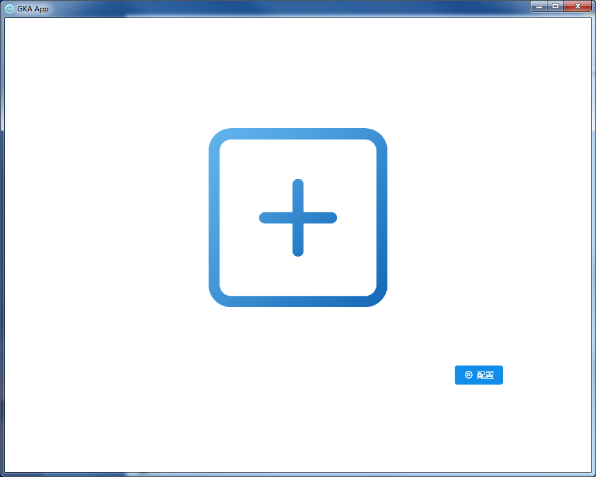
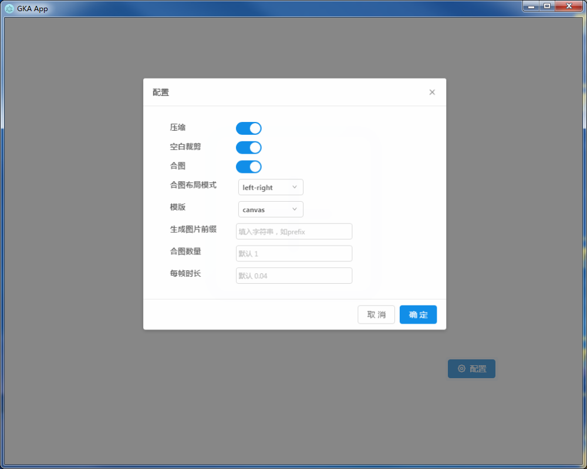

## gka 目录结构

```
app
    --main.js electron主入口
    --gka.js  gka后台生成逻辑
    --app.js  前端页面入口
    --ipc
        --ipc.js 前端与后台ipc通道逻辑
```

## 打包命令

```
pack:win    windows平台
pack:mac    mac平台
pack:linux  linux平台
```

## 预览




